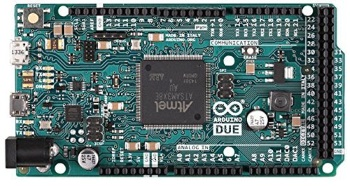
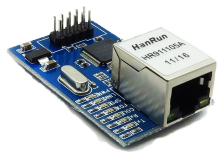
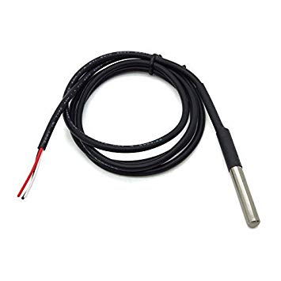
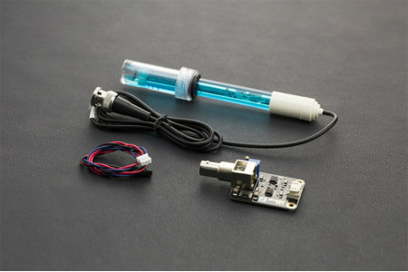
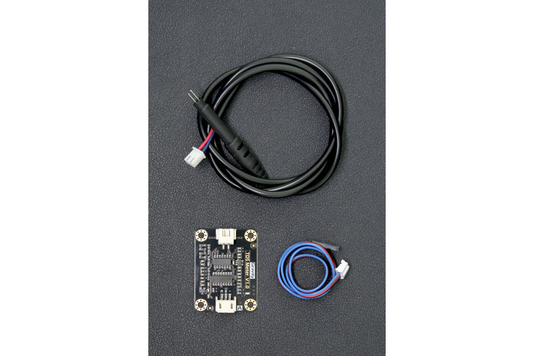
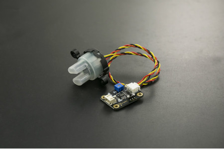
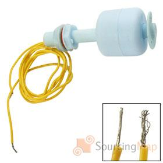
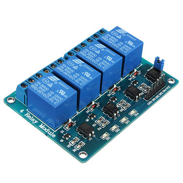
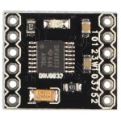

Aquarium connecté Arduino
===================

Bonjour, voici mon projet d'aquarium connecté à base d’arduino.

Contexte du projet
-------------
J'ai acheté un aquarium il y a de cela quelque temps. le hic c'est que j'aime bien aussi voyager, partir en vacances ...
Même si on peut mettre un programmateur pour distribuer la nourriture aux poissons quand on est absent... c'est tout de même rassurant de pouvoir vérifier et agir sur cet écosystème à distance.
Bon le fait que je suis un peu Geek a aussi beaucoup joué sur la création de ce projet.

.Définitions du besoin :
* Récupérer les informations de différents capteurs :
    ** Sondes de température x2
 	** Sonde de pH
 	** Sonde de turbidité
 	** Sonde TDS
 	** Capteur de niveau d'eau
 	** Capteur de débordement (détection de fuite)
 	** une horloge pour avoir l'heure et la date 
 * permettre le pilotage des Actionneurs :
 	** un distributeur de nourriture
 	** un éclairage en mode variateur
 	** un éclairage en on/off
 	** la pompe à air (bulleur) on/off
 	** la pompe du filtre
 * Coté communications :
 	 ** Remonter les information à ma box Domotique via api json.
 	 ** IHM web de consultation et paramétrage
 * Coté intelligence :
    ** automatisation de la gestion de l'éclairage
    ** automatisation de la distribution de nourriture
    ** stockage de la date de dernier changement des différents filtres
    ** alerte en cas de dépassement de seuil sur les capteurs (température/pH/....) 

Présentation 
------------

 - 1 x Arduino Due
 - 1 x Arduino Ethernet Hanrun
 - 2 x capteurs de température ds18b20 
 - 1 x capteur de niveau d'eau
 - 1 x sonde de pH
 - 1 x sonde de turbidité
 - 1 x sonde de TDS
 - 1 Prise commandée gérée par la box domotique pour piloter l'arrosage

